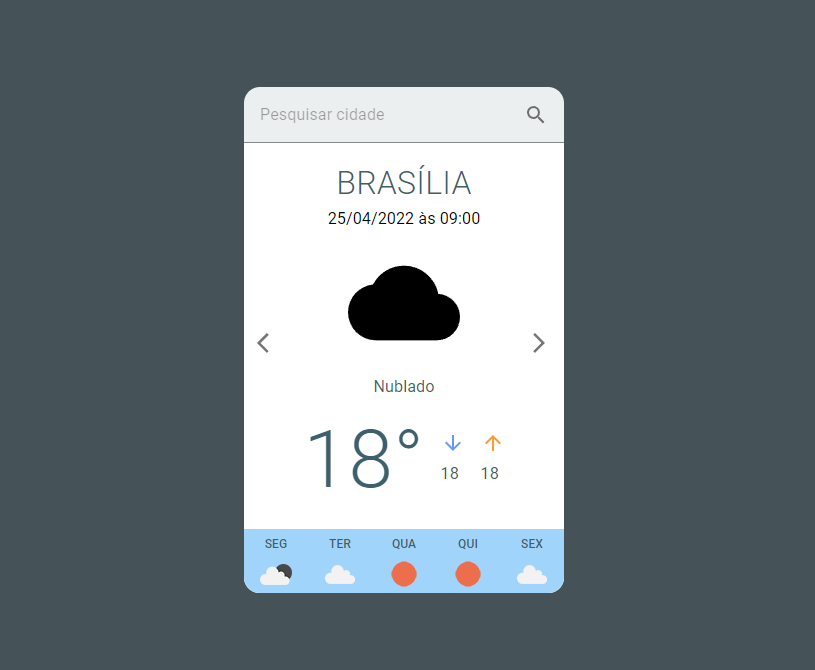

<h1 align="center">
    Previsão do tempo
</h1>

  <a href="#-tecnologias">Tecnologias</a>&nbsp;&nbsp;&nbsp;|&nbsp;&nbsp;&nbsp;
  <a href="#-projeto">Projeto</a>&nbsp;&nbsp;&nbsp;

 

  

## Tecnologias
<a href="https://6265f4b0e9167a1d9e0dc503--curious-cannoli-525a80.netlify.app" target="_blank">Ver Demo</a>

## Tecnologias

Esse projeto foi desenvolvido com as seguintes tecnologias:

- [ViteJS](https://vitejs.dev/)
- [ReactJS](https://reactjs.org)
- [Open Weather](https://openweathermap.org/)
- [Material-UI](https://mui.com/)

## Projeto

Aplicativo para previsão de tempo a cada cinco dias baseando-se na cidade escolhida. Cada dia contém uma previsão a cada três horas.
